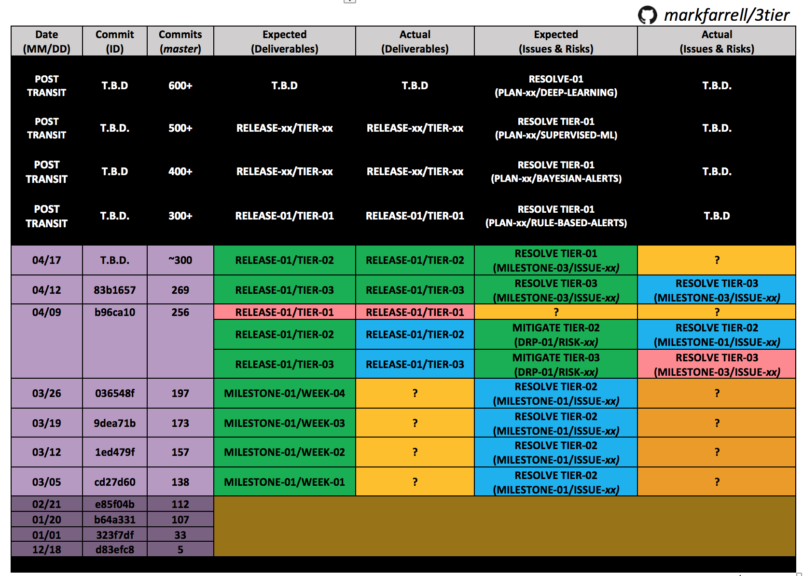

# 3tier
A prototype 3-tier web application written in PureScript. The project is currently a work-in-progress. 

# Contents
- [Proposal](#proposal)
  *  [Abstract](#abstract)
  *  [Introduction](#introduction)
  *  [Timeline](#timeline)

## Proposal

### Purpose

Fileless Malware and Insider Threat incidents are currently causing significant disruptions to the services and operations of industries employing IT. For example, Fileless Malware attacks are currently costing industries, such as healthcare and finance, millions upon millions of dollars due to successful Fileless Malware attacks (e.g. SAMSAM and GoLacker). According to reputable sources, we are currently seeing a dramatic rate of increase in Fileless Malware incidents reported across industries employing IT ([TrendMicro, 2019](https://www.trendmicro.com/vinfo/us/security/news/security-technology/risks-under-the-radar-understanding-fileless-threats)), and it is possible that the majority of successful cyberattacks now involve Fileless Malware incidents that are currently occurring undetected by targeted organizations ([Carbon Black, 2019](https://www.carbonblack.com/resources/definitions/what-is-fileless-malware/)). Our motivational goal for this project is to research & develop a model SIEM/IDS software solution (as a 3-tier web application), that can applied to faciliate security risk management for these types of threats. We are currently seeking applicants & contributors to assist in the research & development, testing, and project management for the current prototype of our 3-tier application. 

### Introduction

Our current overarching goal for this project is to develop a model SIEM/IDS solution written in PureScript.
It is intended to be implemented and deployable as a 3-tier web application, with the goal of exploring the use of PureScript and formal methods to provably mitigate OWASP Top 10 web application security risks within the application.
The <b>presentation-tier</b> is intended to faciliate incident management & response for incidents triggered by detecting anomalous behaviours of entities on a network, derived from forwarded & audited events.
The <b>application-tier</b> is intended to faciliate centralized logging of traffic/gateway events, Linux Auditing System events, and Windows Security event, and e.g. vulnerability scan results.
The <b>data-access tier</b> is intended to faciliate analytics & reporting on forwarded & audited events, as well as:
e.g. security risk management, disaster recovery, and business continuity.
The current prototype development & testing for our 3-tier application  was modeled / inspired by the idea of developing e.g. a model & lightweight FOSS alternative to Splunk, which we summarize with the following diagram of our proposed 3-tier architecture.

### Timeline

